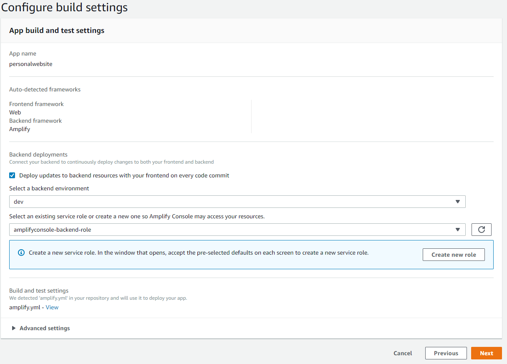
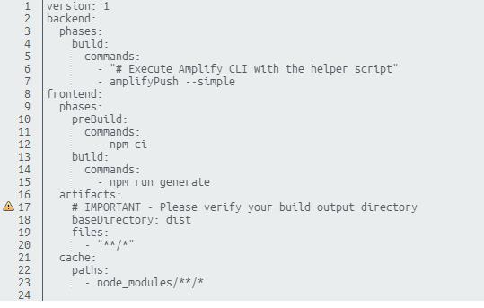
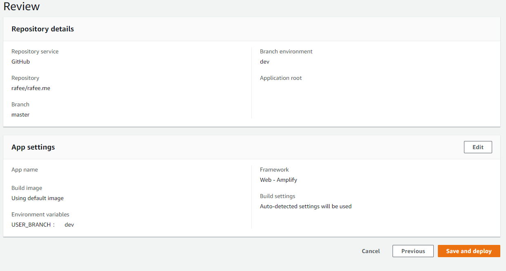

# Creating My Personal Website

I wanted to create my personal website for quite sometime now. I have a [prior website](https://www.mohammadrafee.com), developed using [hugo](https://gohugo.io/). But, I wanted build something in a more hands-on fashion this time. Although, I have very limited experience with front-end, I still took it as a challenge to learn a front-end framework and how front-end frameworks work in general.

## Technology Choices

Once I decided to develop the app using a front-end framework, the next question became the choice. Among different front-end frameworks, Vue seemed least daunting. But Vue's choice of Single Page Application(SPA) model, although lucrative, left some things to be desired. The SPA model is not SEO friendly, which is important for a portfolio website. This is where NUXT came in. NUXT is a framework for Vue, to develop SEO friendly App, along with some additional features, that makes developing a Vue App, much simpler. So I decided to use NUXT for developing front-end.

Now in terms of deploying the application, I ruled out something like NGINX soon. Hosting your own server, felt too expensive for simple static sites. Amazon S3 offers static site hosting. Paired with Cloudfront, S3 offers excellent scalability and free SSL certificate, which is a big advantage. However, in S3+CloudFront combination, some things need to be managed manually (such as domain routing, automatic code-build). Also, if you want to add some other functionality such as login facilities, things will become more complicated.

AWS Amplify is a practical solution to all these problems. Not only Amplify allows static site hosting via S3+CloudFront, it allows automatic instant cache invalidation. Add it to the fact that, amplify allows you to add API (both REST and GraphQL), connect to DB and automatic domain management, automatic build out of the box. It is developed as one stop solution for full-stack app, rather than a individual product.

With all things in place, NUXT + Amplify seemed like a perfect technology to meet my requirement.

## Using Prior Works

While I wish I was smart enough to build the entire application from scratch. But, that's not the case. My front-end skills are too rudimentary to develop the whole application in feasible amount of time. That's why I started looking into internet for prior works. I found [this excellent website](https://jimmykasprzak.com/) by Jimmy Kasprzak with [source code](https://github.com/Orodan/personal-website) available in GitHub. He also included a [great tutorial](https://jimmykasprzak.com/blog/creating-personal-website-with-nuxt/) for anyone to follow.

TLDR, I copied all his styling to develop my website (Something I plan to change in near future). If someone wants instruction on how to develop with NUXT, his website will be more fruitful place.

## Deploying application on Amplify

Assuming you have developed your application using NUXT (By yourself or by following [Jimmy's tutorial](https://jimmykasprzak.com/blog/creating-personal-website-with-nuxt/)), now is the time for deploying your application using Amplify.

The sequence of events are as follows:

* Install Amplify CLI. For detailed instruction [follow this link](https://docs.amplify.aws/cli/start/install).
* Fork the repo [https://github.com/PersonalWebs/personal-website](https://github.com/PersonalWebs/personal-website).
* Clone repo to your own computer.
* Change into the directory personal website. In Linux and Mac, the command should be `cd personal-website` (if you didn't change the name. Otherwise use the name you renamed your repo to).
* Initialize AWS Amplify in this directory. Command for that is `amplify init`.
* You will then be asked a series of questions. They are described below along with suitable answers.
  * Enter a name for the project - `personalwebsite` (You can choose any name you want)
  * Enter a name for the environment - `dev`
  * Choose your default editor - `Visual Studio Code` (I am using VSCode, but you can use any other editor)
  * Choose the type of app that you're building - `javascript`
  * What javascript framework are you using - `vue`
  * Source Directory Path - `src`
  * Distribution Directory Path - `dist`
  * Build Command - `npm run-script build`
  * Start Command - `npm run-script serve`
  * Do you want to use an AWS profile? - If you have already set up a profile when installing Amplify-CLI tools and would like to reuse that, the answer is `Yes`. Otherwise you can set up and use a new profile here. This profile is used to decide which AWS account will be used to deploy the application into cloud.

Now, we need to deploy the front-end app into Amplify. The steps are:

* Add hosting to your Amplify application. This is where your app is built and deployed into cloud. The command is `amplify add hosting`. Like previous situation, this will also delve into a series of questions.
  * Select the plugin module to execute (Use arrow keys) - `Hosting with Amplify Console (Managed hosting with custom domains, Continuous deployment)`
  * Choose a type - `Continuous deployment (Git-based deployments)`. This should open an url in browser.
  * In your browser, first integrate GitHub with AWS Amplify. After that, your repos should show up.
  
  Note that, AWS UI has some sort of glitch, which may or may not redirect you several times. However, if you do everything in the expected fashion, no error should occur. Also, ignore the warning in my screenshot. You shouldn't see this warning unless you are linking same repo to multiple app.
  * Now you have to select backend name and role. Although technically, our app doesn't have a backend, as it's still a static website; this is a manadatory step. If you haven't created an amplify project before, you will be required to create a role, which is a simple process where you have to click next several times.
  
  Note that our repo has automatically identified the amplify.yml in the repository as the build container.
  
  Here, the dependencies are installed using `npm ci` command and files are generated via `npm run generate`. The command `amplifyPush --simple` will be necessary when you build an actual backend. For this application, you can either ignore or delete it if you want.
  * Finally it should show all your selected settings and you should be able to see this before final deploy.
  
  * Once you click depoy, you can come back to terminal. It should display `Continuous deployment is configured in the Amplify Console. Please hit enter once you connect your repository`. If you hit enter now, you should see something like this
  

And that's about it. Now you have a fully functional web application with your portfolio. Not only this, any articles that you store on markdown format in `content/articles`, automatically shows up on your web application. While this may seem like too much work for hosting a static website, this is just the start. You can very easily manage custom domains, additional API, login, Android/iOS app from this single platform. If everyone likes this, I'll extend and share more tutorial in future. Also remember, from now onwards, if you make any change on your application and commit it, this will be automatically built and deployed without any intervention or change from your end. So much about `CI/CD`. NoOps is the new game in town!